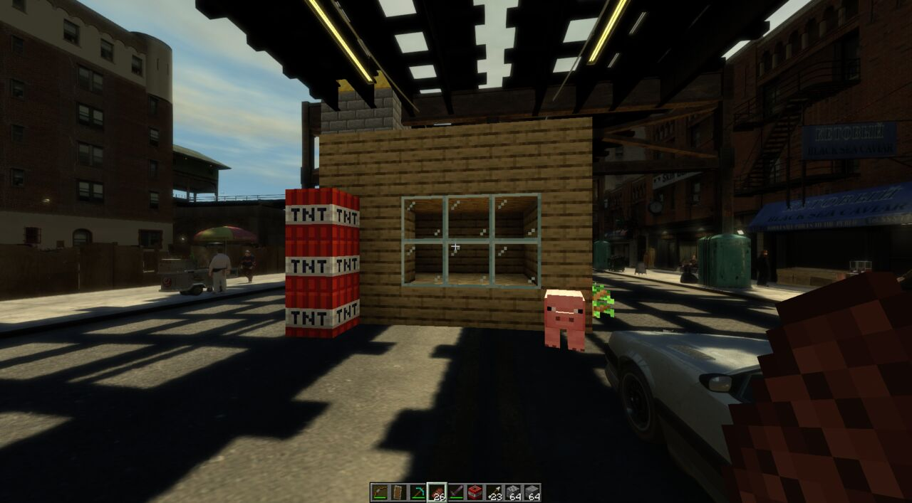
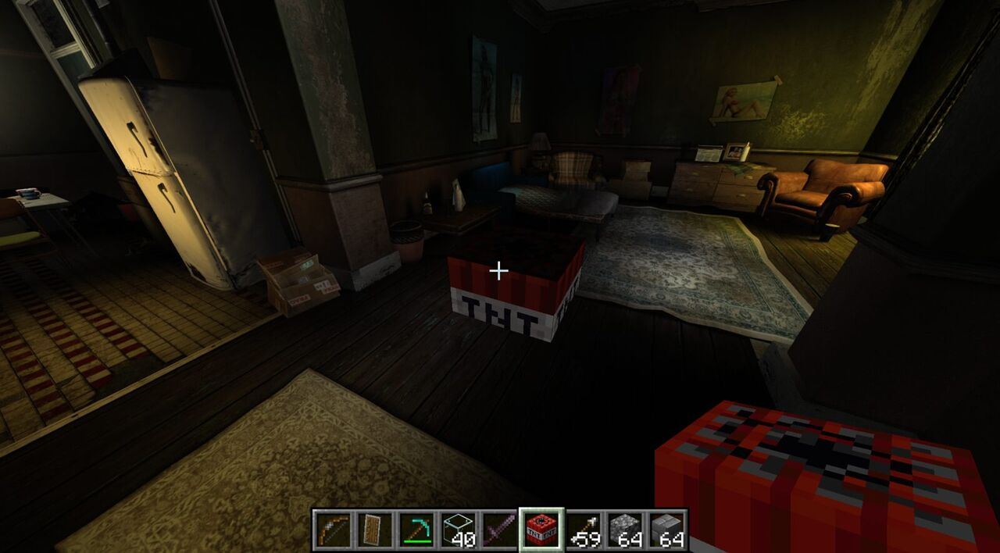
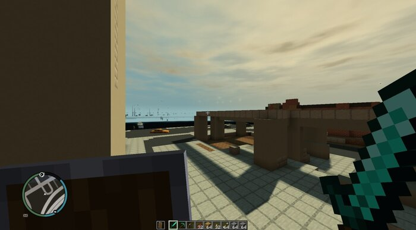
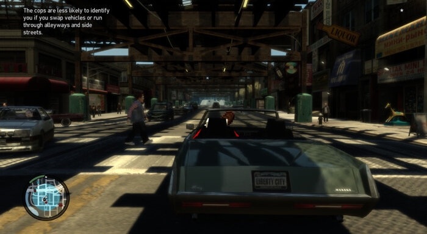
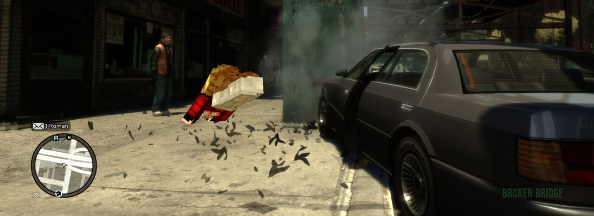
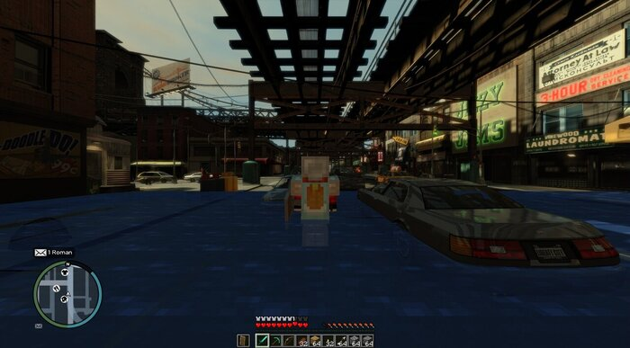
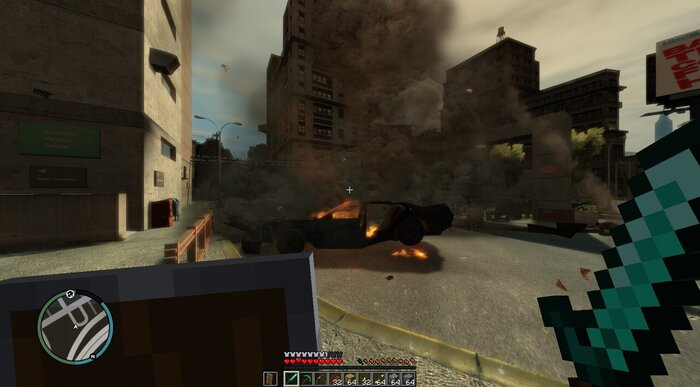

# LibertyCraft: Minecraft inside GTA IV

Play Grand Theft Auto IV as a Minecraft player. Minecraft (the real Java Edition, running hidden
in the background via Fabric) owns your movement, inventory, hotbar and the blocks you place and
break; GTA IV owns the camera and the picture, and draws the blocks inside Liberty City.

This is a port of the idea (and most of the Minecraft-side code) of
[SkyCraft](https://github.com/chasmlol/SkyCraft) by chasm, which does the same for Skyrim.

> **Status: early development, but playable.** Minecraft drives Niko, its blocks and HUD render in
> Liberty City with GTA's lighting, collision follows GTA IV's map, combat and crimes work both ways, and
> your Minecraft character plays Niko in cutscenes and cars. See [Milestones](#milestones).

## Installation

### Requirements

* **GTA IV: The Complete Edition** on Steam. LibertyCraft downgrades it to **1.0.8.0** (the
  version IV-SDK and ZolikaPatch support) and installs the ASI loader, FusionFix and ZolikaPatch.
* **Minecraft: Java Edition** (owned) with [Prism Launcher](https://prismlauncher.org/) and a
  Minecraft account signed in. Java 25 is picked up from Prism's own runtimes.
* Windows release installs use PowerShell 5.1, included with supported Windows versions. Windows
  source builds need Visual Studio 2022 with the C++ and Clang tools, the Windows SDK, CMake, Git,
  and a JDK 25.
* Linux release installs need `bash`, `curl`, `unzip`, `python3`, `tar`, and `sha256sum`.
* Linux source builds need `xwin`, `clang` (clang-cl), `lld`, `llvm` (llvm-rc), `cmake`, `ninja`, and a JDK 25
  (Gradle fetches the rest). `tools/setup-toolchain.sh` checks them and prints the install line, e.g.
  `paru -S xwin clang lld cmake ninja jq 7zip unzip curl python jdk-openjdk`.

### Windows release install

1. Install GTA IV: The Complete Edition through Steam. Install Prism Launcher and sign in to
   Minecraft Java Edition. Quit GTA IV and Prism Launcher before setup.
2. Download and extract
   [`libertycraft-windows.zip`](https://github.com/mrborghini/libertycraft/releases/latest/download/libertycraft-windows.zip).
3. Run `install-windows.bat`. It searches Steam libraries for GTA IV and the usual Prism data
   folders. If it cannot find either folder, it asks for the path. The installer downgrades the game,
   installs the loader and patches, copies LibertyCraft, and configures the Prism instance. If Steam
   is under a protected folder and Windows denies file access, run the batch file as administrator.
4. Open Prism Launcher and start the `LibertyCraft` instance once. Prism downloads Minecraft 26.3,
   Fabric, and Java 25. Sign in if asked. Start Minecraft before launching GTA IV from Steam so its
   hidden window is ready before the game starts.
5. To restore the GTA IV files changed by the installer, run `install-windows.bat -Uninstall` from
   the extracted folder. The Prism instance and its worlds are kept.

The Windows installer downloads the same pinned GTA IV 1.0.8.0 assets as the Linux installer and the
latest FusionFix archives. Files it replaces are backed up under
`GTAIV/_libertycraft_backup/manifest.txt`.

### Linux release install

1. Install GTA IV: The Complete Edition through Steam and enable Proton. Install Prism Launcher,
   sign in to Minecraft Java Edition, and quit both launchers before setup.
2. In a terminal, run:

   ```sh
   curl -fsSL https://github.com/mrborghini/libertycraft/releases/latest/download/install-linux.sh | bash
   ```

   The installer downloads the latest published release, verifies its SHA-256 checksum, detects the
   Steam and Prism locations, downgrades GTA IV, installs its loader and patches, and configures the
   `LibertyCraft` Prism instance. It backs up replaced game files with a manifest. It does not install
   Steam, Prism Launcher, or Minecraft accounts.
3. Open Prism and start the `LibertyCraft` instance once so it can download Minecraft 26.3, Fabric,
   and Java 25. Sign in if asked. Start Minecraft before launching GTA IV from Steam.
4. To restore the game files, run
   `curl -fsSL https://github.com/mrborghini/libertycraft/releases/latest/download/install-linux.sh | bash -s -- --uninstall`.
   The Prism instance and its worlds are kept.

The release download points to the latest published GitHub release. The workflow publishes each
successful release automatically, so both installers become available as soon as packaging finishes.

### Releases from main

Every push to `main` builds both platform packages. The workflow finds the highest stable `vMAJOR.MINOR.PATCH`
tag and increments its patch number for the next release. If there are no version tags yet, it uses the
version in `fabric/gradle.properties`. It builds the Fabric mod with that version, creates the matching
Git tag on the pushed commit, and publishes a GitHub release with the Windows and Linux packages,
installers, and checksums attached. Pushing a `vMAJOR.MINOR.PATCH` tag directly builds and publishes
that exact version.

## Screenshots


*Real Minecraft blocks and mobs on a Broker street, lit by GTA IV's sun and hidden behind its world.*

| | |
|---|---|
|  |  |
| Blocks indoors, with the Minecraft HUD | Through a nether portal: Blocky Liberty City, with GTA's sky and traffic |
|  |  |
| Driving (F steals a car the GTA way) | Bailing out of a moving car: GTA's ragdoll, Minecraft's body |
|  |  |
| Minecraft water floods the street and stalls the cars | Crossbow fire wrecks a car (fireworks bring down helicopters) |

## How it works

```
 ┌──────────────────────────┐   shared-memory file (/dev/shm)   ┌──────────────────────────────┐
 │ Minecraft 26.3 + Fabric  │ ───── block meshes, HUD, state ──▶ │ GTA IV 1.0.8.0 (Proton)      │
 │ hidden window            │ ◀──── input, camera, collision ─── │ LibertyCraft.asi (IV-SDK)     │
 │ owns player physics,     │                                    │ draws blocks with D3D9,      │
 │ world, inventory         │                                    │ puppets Niko, samples terrain │
 └──────────────────────────┘                                    └──────────────────────────────┘
```

* `fabric/`: the Minecraft mod (fork of SkyCraft's, MIT).
* `asi/`: the GTA IV plugin, built on [IV-SDK](https://github.com/Zolika1351/iv-sdk) (GPL-3.0).
* `protocol/`: the shared-memory protocol both sides implement (byte-compatible with SkyCraft v11).
* `tools/`: install/downgrade, build and launch scripts, plus Python stand-ins for either side.

## Build from source

```sh
tools/install.sh        # 1. downgrade GTA IV, install the ASI loader, ZolikaPatch, FusionFix,
                        #    create the "LibertyCraft" Prism instance (Minecraft 26.3 + Fabric)
tools/setup-toolchain.sh && tools/build.sh --install
                        # 2. build LibertyCraft.asi + the Fabric mod and copy them in place
tools/launch.sh         # 3. start Minecraft (hidden) and GTA IV
```

On Windows, initialize the IV-SDK submodule, then build the plugin and Fabric mod:

```bat
git submodule update --init
cd asi
cmake --preset windows-release
cmake --build --preset windows-release --config Release
cd ..\fabric
gradlew.bat build -Pversion=0.1.0
cd ..
mkdir dist\plugins 2>nul
mkdir dist\mods 2>nul
copy asi\build\windows-release\Release\LibertyCraft.asi dist\plugins\
copy fabric\build\libs\libertycraft-0.1.0.jar dist\mods\
```

The Windows CMake preset builds the 32-bit plugin with Visual Studio's clang-cl toolset. The Linux
cross-build remains available with `tools/setup-toolchain.sh` and `tools/build.sh`.

The Linux install and build scripts support `--dry-run` and `--help`; `install.sh` and `build.sh`
also take `--yes`. The Windows batch installer accepts `-GameDir` and `-PrismDir` to select paths
directly, and `-Uninstall` to restore game files. Re-running either platform's installer is safe.

What `tools/install.sh` does to the game folder (`…/steamapps/common/Grand Theft Auto IV/GTAIV`):

* Replaces `GTAIV.exe` with 1.0.8.0 plus its scripts/text (`script.img`, `*.gxt`, `PlayGTAIV.exe`,
  `play.dll`), from [Gillian's downgrade assets](https://github.com/gillian-guide/GTAIVFullDowngradeAssets)
  (the same defaults as Gillian's GTA IV Downgrade Utility). `--full` also copies the complete
  1.0.8.0 file set.
* Installs Ultimate ASI Loader **as `xlive.dll`** (FusionFix Legacy Addon). 1.0.8.0 needs Games for
  Windows Live's `xlive.dll`; this one replaces GFWL and loads the `.asi` plugins, so no
  `dinput8.dll` and no `WINEDLLOVERRIDES` are needed.
* Installs ZolikaPatch (with the options FusionFix already covers switched off), FusionFix
  (`plugins/`, `update/`) and, once built, `plugins/LibertyCraft.asi`.
* With `--radio` (optional, ~1 GB download) it also installs Tomasak's
  [Radio Restoration Mod](https://github.com/Tomasak/GTA-Downgraders/releases/tag/iv-latest), which brings back the
  songs removed from the Steam release, into `update/`. `--radio=vanilla` keeps only the original tracklist; see
  `tools/install.sh --help` for the other variants.
* Backs up every file it replaces to `_libertycraft_backup/` with a manifest;
  `tools/uninstall.sh` (= `install.sh --uninstall`) restores them and deletes what was added.
  Steam → GTA IV → Properties → Installed Files → **Verify integrity of game files** also reverts
  the downgrade (and so does a Steam update of the game; just run `tools/install.sh` again).

Recommended Steam launch options (Properties → General): `PROTON_LOG=1 %command%` while developing
(writes `~/steam-12210.log`). Logs: Minecraft `…/PrismLauncher/instances/LibertyCraft/minecraft/logs/latest.log`,
the plugin `<gamedir>/LibertyCraft.log`. `tools/dev/run-gta-with-log.sh` starts the game through Proton
directly with `PROTON_LOG=1`, without touching Steam's launch options.

## Controls

In **Minecraft mode** (the default) you play Minecraft: its keys, mouse, hotbar and inventory work
as usual (`E` inventory, `T` chat, `F5` third person). GTA IV only keeps a few keys:

| Key | What it does |
|---|---|
| `F` | enter or steal the nearest car the GTA way. You drive with GTA's controls and the Minecraft player rides a boat in the seat; `F` again gets out and Minecraft takes over. Minecraft keeps your health in the car too (creative stays immortal, in survival crashes, gunfire and a car blowing up cost hearts); in creative peds can't drag you out |
| `\` (Backslash) | switch between Minecraft mode and **Niko mode** (plain GTA IV, e.g. if something misbehaves); the Minecraft player follows Niko and takes over where he stands. A mission's on-foot scenes (its camera, its moves, a minigame) hand Niko to GTA by themselves, with your Minecraft body on him, and back when they end |
| `O` | Minecraft's pause / options menu |
| `Esc`, `F1` to `F12`, `` ` `` | GTA IV's own (pause menu, ...). GTA IV's pause menu pauses a singleplayer Minecraft world and its sounds too, until the menu closes; so do GTA's cutscenes (Minecraft's monsters stay out of them), and phone calls turn Minecraft's sounds down |

Keys and the boat/horse/minecart mount can be changed in `GTAIV/plugins/LibertyCraft.ini` and
Minecraft's `config/libertycraft.properties`.

## Blocky Liberty City

Build a nether portal frame of obsidian anywhere in Liberty City and light it: it leads to **Blocky
Liberty City**, a Minecraft dimension (`libertycraft:blocky_city`) that copies the city block for block,
at the same coordinates (1:1), built from the collision GTA IV has streamed to Minecraft. Every street
you walk down in GTA IV is remembered in the world save (`saves/LibertyCraft/libertycraft_city/`, about
150 KiB per street block, written in the background), so the copy grows as you explore, also while you walk
around in it; where nobody has been yet there is nothing but air behind an invisible wall. GTA IV's own
surface materials pick the blocks: tarmac becomes gray concrete, pavements smooth stone, brick walls
bricks, glass glass, grass grass, roofs gray concrete, metal iron, wood planks; GTA IV's water becomes
Minecraft water. Parts built before newer data arrived fill in when you are there (what is already
built stays, so your own builds are safe).

You stay in GTA IV: it hides its own buildings, terrain and props while you are in the blocky city and
draws the city's blocks in their place, around the same streets, with its sky, weather, water, people,
traffic and HUD. Peds and cars still walk and drive on GTA IV's own (invisible) city, which the blocks
copy. A nether portal there (the one you arrived through, or one you build) leads back to the same spot
in Liberty City, and GTA IV's map comes back.

`blockyCity=false` in Minecraft's `config/libertycraft.properties` makes nether portals do nothing;
`blockyCityRenderDistance` (12 chunks) is how far the city is drawn around you (Minecraft keeps its own
render distance everywhere else). GTA IV only holds the blocks within that distance: what is further
behind you is dropped and comes back as you return.

## Starter kit

A new world starts with a kit. In the hotbar: a netherite pickaxe with Silk Touch, Unbreaking III and
Efficiency V, a plain diamond pickaxe, cobblestone and planks to bridge with, torches, steak, a crafting
table and an ender chest. Above them, thirteen shulker boxes, each its own colour and name: **Spawn
Eggs** (every mob's egg, monster spawners), **Redstone**, **Travel**, **Building**, **Combat** (enchanted
swords, axes, maces, tridents, bows and a spear, every tier unenchanted, tipped arrows), **Armor Sets**
(every tier, a turtle shell, wolf armour, an elytra), **Enchanted Armor** (netherite sets in each kind of
Protection IV and a diamond set, every piece with Unbreaking III and Mending), **Trimmed Armor** (every
trim pattern, the trim materials, dyed leather, the smithing templates), **Fireworks**, **Food &
Farming**, **Potions & Utility** (every brewable potion, drinkable, splash and lingering), **Nether &
End** and **Spares**. A box holds 27 different things; where a theme has more, they come in bundles (a
few each of many items, such as one bundle per four spawn eggs) or in named chests of full stacks (place
the chest to unpack it, as with the building blocks and the potions).

The **Fireworks** box is for the crossbow (one with Multishot, one with Piercing IV, both Quick Charge
III): a row of rockets per flight duration (1 to 3), each row 1 to 7 stars of every shape and colour,
64 of each. GTA IV turns a crossbow's rocket into a blast that grows with its stars, and each rocket's
name says how far: "1 star: 4 m blast" up to "5 stars: 8 m blast" (GTA's full rocket blast; more stars
only add colour). Firework stars, gunpowder and paper are there to make more.

`/libertycraft kit` gives the kit again in a world you already play in: it only fills empty slots, never
adds to what you carry, and says what didn't fit. `starterKit=false` in `config/libertycraft.properties`
starts new players with an empty inventory instead.

## Mobs in Liberty City

Minecraft's mobs and GTA IV's city meet:

* **Cars run mobs over.** Any GTA IV vehicle, traffic or the one you drive, that drives into a mob at
  2.5 m/s or more hurts it by its speed (a zombie dies at 10 m/s) and throws it along the car's way; slower,
  it just pushes it aside. What your own car runs over is your kill (drops and experience).
* **Hostile mobs hunt GTA IV's peds** the way they hunt you: zombies, skeletons, spiders, creepers,
  pillagers, witches and the rest go after peds on foot and cars with someone in them (yours too), with
  their own weapons: blows, arrows, potions, a creeper's blast, a ghast's fireball. They walk GTA IV's
  streets, stairs and ramps, don't see through its walls, and walk straight at what they can't find a
  path to. Your survival player is still their target too; none of it is your crime.
* **GTA IV's explosions reach Minecraft.** A car or a gas pump blowing up, a grenade, a rocket or a
  molotov hurts and throws Minecraft's mobs and, in Minecraft mode, you, like a Minecraft explosion of that
  size (a molotov or a burning car also sets them alight); it breaks no blocks. Only one of the two ever
  counts: in Minecraft mode Minecraft's, while GTA IV drives you (Niko mode, a car) GTA IV's own.
* **Mobs hurt Niko too.** In Niko mode a mob's blow, arrow or crossbow bolt takes GTA IV's health off
  Niko and knocks him over the way your hits knock peds over (`RagdollOnHit`, `HitForce`; a ravager's
  blow throws him further), so a swarm can keep him down; he gets back up when it lets him. An iron
  golem's blow throws him up into the air, as it throws you in Minecraft mode. A creeper's blast is GTA
  IV's own explosion.
* **Peds fight back.** Armed peds and police nearby shoot at a mob that goes after someone, and GTA IV's
  bullets hurt mobs (four pistol shots kill a zombie); other peds run, drivers drive off. `PedsFightMobs=0`
  in `LibertyCraft.ini` turns this off. GTA IV's bullets stop at every Minecraft mob near you, not only
  monsters: an iron golem soaks up a shootout with its 100 health and turns on whoever shot it, and a cow
  or a villager in the line of fire takes the bullet.
* **Golems guard you.** Iron golems (and snow golems) and GTA IV's peds, set by `golemTargets` in
  `config/libertycraft.properties`: `guard` (the default, like a wolf) attacks the peds and police who
  attack you and the peds you attack; `cops` attacks police on sight as well; `hostile` attacks any ped on
  sight; `vanilla` means golems only attack Minecraft mobs (vanilla's hostile-mob targeting, plus players
  who anger them) and GTA IV's peds are never targets. Mission characters never are. As in Minecraft, a
  golem you built never turns on you, and one from a spawn egg, a command or a village does when you hit
  it. Its blow throws a ped (or you) up into the air; the ped's friends and the police shoot back.
* **`/libertycraft mobs on|off`** (saved with the world, off by default) spawns mobs the Minecraft way:
  at night by GTA IV's clock hostile mobs 24 to 64 blocks from you on the street (up to 24 around you), by
  day now and then a few farm animals on GTA IV's grass. Undead burn in GTA IV's sun: Minecraft's time of
  day follows GTA IV's clock. `off` removes the mobs it spawned (not those from eggs, spawners or commands).
* **GTA IV's roofs are shade.** Undead don't burn in GTA IV's interiors or under its roofs, balconies,
  bridges, awnings and el-train tracks, and a burning one with no target runs for that shade as in
  Minecraft (one with a target keeps fighting). Rain doesn't reach under them either.
* **GTA IV's water is theirs too.** By day a drowned on land heads for GTA IV's harbour, rivers and sea; a
  zombie that stays under its water turns into a drowned (a husk into a zombie) as in Minecraft.
* **Nothing falls through the city.** A mob over ground GTA IV hasn't described yet (far below you on a
  roof, deep water, just after a world change) waits where it is until it has, instead of falling into
  the void.

## One sky

Minecraft's time and weather are GTA IV's. Minecraft's clock follows GTA IV's, and its weather follows
GTA IV's weather (rain while it rains, thunder in its storms; rain puts out fires and keeps the undead
from burning, but not indoors or under GTA IV's roofs, which stay dry). The other way round, `/time set` (day, noon, night, midnight or a tick count) and
`/time add` set GTA IV's clock (Minecraft's tick 0 is 06:00, so `night` is 19:00 and `midnight` 00:00),
sleeping through the night in a bed brings GTA IV's morning, and `/weather clear`, `/weather rain` and
`/weather thunder` (with an optional duration) change GTA IV's weather on the spot (extra sunny, rain, a
thunderstorm); when the time is up GTA IV's own weather takes over again.

## Milestones

- [x] **M0**: repo, scripted downgrade (`tools/install.sh`), plugin loads in-game under Proton
- [x] **M1**: Fabric mod runs on Linux; Minecraft links to GTA IV through `/dev/shm`
- [x] **M2**: Niko moves with Minecraft physics; mouse look; keyboard forwarded
- [x] **M3**: Minecraft blocks rendered in Liberty City (lit like Minecraft, hidden behind GTA's buildings) and the Minecraft HUD composited over the game
- [x] **M4**: collision from GTA IV's real map geometry: streets, stairs, interiors, overpasses, walls; water for swimming
- [x] **M5**: combat: Minecraft hits damage/ragdoll/kill peds, TNT and creepers make GTA explosions, GTA damage hurts the Minecraft player, death runs GTA's "wasted" flow
- [x] **M6**: cars (F steals one the GTA way, the Minecraft player rides a boat in it) and Backslash to switch between Niko and Minecraft
- [x] **M7**: your Minecraft character plays Niko when GTA animates him (cutscenes, cars, bail-outs, knockdowns);
  doors open, street furniture is solid, NPCs and cops fight back, Minecraft attacks count as crimes, cars and
  their occupants can be hit, optional radio restoration
- [x] **M8**: blocks and your Minecraft body take and cast GTA's sun shadows (same cascades and filtering as GTA),
  both HUDs at once with GTA's health and armour mirroring Minecraft, shields block GTA hits, GTA's phone works in
  Minecraft mode
- [x] **M9**: Minecraft blocks stop GTA's bullets, Minecraft attacks feed GTA's own crime system (wanted levels
  escalate), killing blows ragdoll, Minecraft fire and lava burn peds and cars, cars slow and stall in Minecraft
  water, a trimmed Minecraft HUD in vehicles
- [x] **M10**: walking into peds pushes them (sprinting makes them stumble), elytra, falls and sprint-jumps knock
  them down by speed, corpses can be hit and dragged, doors swing open and shut on GTA's own hinges, every vehicle
  (helicopters and their rotors too) knocks you over, and entering interiors no longer drops Minecraft mode
- [x] **M11**: fireworks fired from a crossbow explode like GTA rockets (they bring down helicopters), nether
  portals lead to Blocky Liberty City, softer knockdowns and corpse pushes, cops shoot back at the Minecraft player,
  held items hidden in vehicles, no void when the camera is outside an interior's door

Known gaps: no shadows on blocks indoors; peds wade instead of swim in Minecraft water; cutscene support needs
1.0.8.0; peds take double damage from Minecraft's TNT and creepers (not from fireworks). Blocky Liberty City
loses lamp posts and other thin street furniture, and can sit up to half a block off GTA's ground, and a hole dug there refills when newer data for that
chunk arrives.
GTA's own ladders can't be climbed in Minecraft mode (Minecraft ladders can). (Windscreens can't be broken in vanilla GTA IV either, so only side windows shatter.)
Mobs: they path over GTA IV's collision as 1/8-block voxels, so very narrow gaps, GTA's ladders and some
furniture still stop them (a mob that finds no path walks straight at its target and may stand at a wall);
a mob's plain blow doesn't knock a ped over; only the ped a mob is after and police within 25 m react, peds
in cars don't shoot; GTA IV's vehicles more than 60 m from you (and trains, planes, rotors) don't run mobs
over; the spawner only uses ground GTA IV has described around you. GTA IV's water reaches Minecraft out
to about 40 blocks from you: further out a mob in it stands on a dry sea bed (and burns by day). Where
GTA IV's collision has no sea bed (deep water) a mob sinks to where its collision stops and waits there.
Shade is only what GTA IV has described above a spot (up to 48 blocks). Time and weather: GTA IV's 19:00
(`/time set night`) is still dusk; GTA IV's cloudy and foggy weathers are clear in Minecraft.

## Licenses

* Everything outside `asi/` is **MIT** (see `LICENSE`), including the Fabric mod (derived from SkyCraft, MIT).
* `asi/` (the GTA IV plugin) is **GPL-3.0** (see `asi/LICENSE`) because it is built on IV-SDK, which is GPL-3.0.
* Third-party notices: `THIRD-PARTY-NOTICES.md`.

## Credits

* [SkyCraft by chasm](https://github.com/chasmlol/SkyCraft): the idea, the protocol and the Minecraft side.
* [IV-SDK by Zolika1351](https://github.com/Zolika1351/iv-sdk) and ZolikaPatch.
* [FusionFix by ThirteenAG](https://github.com/ThirteenAG/GTAIV.EFLC.FusionFix) and Ultimate ASI Loader.
* [Gillian's guide](https://gillian-guide.github.io/) for the downgrade assets and procedure.
